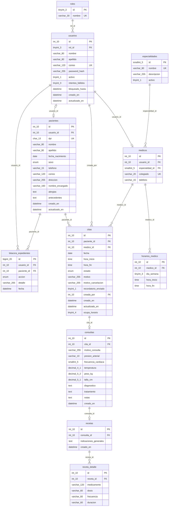

# Diagrama entidad-relación

Base de datos `clinica_nova_salud` de MediAgenda (Clínica NovaSalud). La imagen `diagrama-er.png` muestra el mismo modelo.

```mermaid
erDiagram
    roles ||--o{ usuarios : "rol_id"
    pacientes ||--o{ bitacora_expedientes : "paciente_id"
    usuarios ||--o{ bitacora_expedientes : "usuario_id"
    usuarios |o--o| pacientes : "usuario_id"
    usuarios ||--o{ citas : "creada_por"
    medicos ||--o{ citas : "medico_id"
    pacientes ||--o{ citas : "paciente_id"
    especialidades ||--o{ medicos : "especialidad_id"
    usuarios ||--o| medicos : "usuario_id"
    citas ||--o| consultas : "cita_id"
    medicos ||--o{ horarios_medico : "medico_id"
    consultas ||--o| recetas : "consulta_id"
    recetas ||--o{ receta_detalle : "receta_id"
    roles {
        tinyint_3 id PK
        varchar_30 nombre UK
    }
    usuarios {
        int_10 id PK
        tinyint_3 rol_id FK
        varchar_80 nombre
        varchar_80 apellido
        varchar_120 correo UK
        varchar_255 password_hash
        tinyint_1 activo
        tinyint_3 intentos_fallidos
        datetime bloqueado_hasta
        datetime creado_en
        datetime actualizado_en
    }
    especialidades {
        smallint_5 id PK
        varchar_80 nombre UK
        varchar_255 descripcion
        tinyint_1 activo
    }
    medicos {
        int_10 id PK
        int_10 usuario_id FK
        smallint_5 especialidad_id FK
        varchar_20 colegiado UK
        varchar_15 telefono
    }
    horarios_medico {
        int_10 id PK
        int_10 medico_id FK
        tinyint_3 dia_semana
        time hora_inicio
        time hora_fin
    }
    pacientes {
        int_10 id PK
        int_10 usuario_id FK
        char_13 dpi UK
        varchar_80 nombre
        varchar_80 apellido
        date fecha_nacimiento
        enum sexo
        varchar_15 telefono
        varchar_120 correo
        varchar_255 direccion
        varchar_160 nombre_encargado
        text alergias
        text antecedentes
        datetime creado_en
        datetime actualizado_en
    }
    citas {
        int_10 id PK
        int_10 paciente_id FK
        int_10 medico_id FK
        date fecha
        time hora_inicio
        time hora_fin
        enum estado
        varchar_255 motivo
        varchar_255 motivo_cancelacion
        tinyint_1 recordatorio_enviado
        int_10 creada_por FK
        datetime creado_en
        datetime actualizado_en
        tinyint_4 ocupa_horario
    }
    consultas {
        int_10 id PK
        int_10 cita_id FK
        varchar_255 motivo_consulta
        varchar_10 presion_arterial
        smallint_5 frecuencia_cardiaca
        decimal_4_1 temperatura
        decimal_5_2 peso_kg
        decimal_5_1 talla_cm
        text diagnostico
        text tratamiento
        text notas
        datetime creado_en
    }
    recetas {
        int_10 id PK
        int_10 consulta_id FK
        text indicaciones_generales
        datetime creado_en
    }
    receta_detalle {
        int_10 id PK
        int_10 receta_id FK
        varchar_120 medicamento
        varchar_60 dosis
        varchar_60 frecuencia
        varchar_60 duracion
    }
    bitacora_expedientes {
        bigint_20 id PK
        int_10 usuario_id FK
        int_10 paciente_id FK
        enum accion
        varchar_255 detalle
        datetime fecha
    }
```